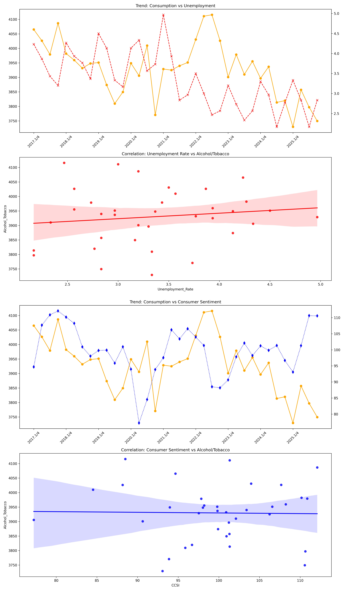
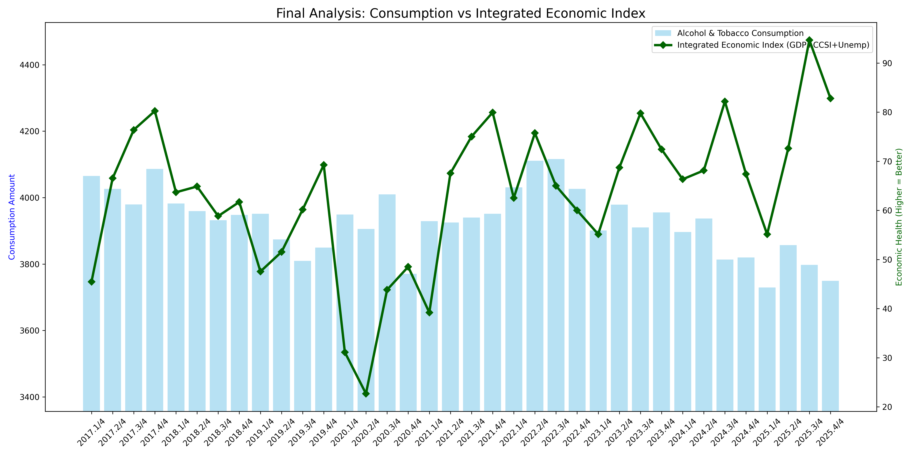

# 📊 한국 경제 지표와 술·담배 소비의 상관관계 분석
> **연구 가설: "나라의 경기가 어려우면 술, 담배의 소비가 늘어나는가?"**

본 프로젝트는 2017년부터 2025년까지의 한국 주요 경제 지표 데이터를 전처리하고 분석하여, 경제 상황과 기호품(술·담배) 소비 사이의 통계적 상관관계를 규명합니다.

---

## 1. 🎯 연구 동기 및 가설
*   **가설**: 불황일수록 스트레스 해소를 위한 기호품 소비가 증가하는 '불황형 소비' 패턴이 나타날 것이다.
*   **검증 지표**:
    *   **경제 상태**: GDP 기여도, 소비자심리지수(CCSI), 실업률을 통합한 **'통합 경제 건강도 지수'** 산출
    *   **소비 상태**: 가계 최종소비지출 중 **'주류 및 담배'** 항목 추출

## 2. 📚 데이터 소스 (Data Sources)
본 분석에는 한국은행 및 통계청에서 제공하는 4종의 공공 데이터를 활용하였습니다.
1.  **최종소비지출.csv**: 가계의 목적별 지출 데이터 (술·담배)
2.  **성장기여도.csv**: GDP 성장에 대한 지출항목별 기여도
3.  **실업률.csv**: 전국 및 연령별 실업률 데이터
4.  **소비자심리지수(CCSI).xlsx**: 소비자의 주관적 경제 체감 지수

## 3. 🛠 기술 스택 (Tech Stack)
*   **Language**: Python 3.10
*   **Data Analysis**: Pandas, NumPy, SciPy
*   **Visualization**: Matplotlib, Seaborn

## 4. ⚙️ 데이터 전처리 (Preprocessing)
`preprocessing.py`를 통해 복잡한 원본 데이터를 분석 가능한 단일 데이터셋으로 가공했습니다.
*   **Wide to Long**: 가로로 긴 통계 데이터를 시계열 분석에 적합한 세로 데이터로 변환
*   **Resampling**: 월 단위 데이터(실업률, CCSI)를 분기 단위 평균값으로 통일
*   **Encoding**: 한글 깨짐 방지를 위해 `cp949` 및 `utf-8-sig` 인코딩 적용
*   **Automation**: `results/` 폴더 내에 정제된 CSV 및 시각화 보고서 자동 생성

## 5. 📈 분석 결과 및 시각화
### 🧪 가설 검증 결과 (Hypothesis Verification)
`data.py`를 통해 도출된 통계적 분석 수치와 최종 결론입니다.

```text
============================================================
 [최종 분석 보고서: 가설 검증]
============================================================
가설: '나라의 경기가 어려우면 술, 담배의 소비가 늘어난다.'
연동 데이터: 36개 분기 (2017~2025)
상관계수(Correlation ratio): -0.0728
------------------------------------------------------------
[분석 결과]
▶ 결론: 가설을 부분적으로 지지합니다. (약한 상관성)
해설: 경기가 나쁠 때 소비가 늘어나는 경향이 미세하게 나타납니다(상관계수가 음수임).
      다만 상관성이 낮으므로 경기 외의 다른 요인(가격 인상 등)도 큼을 의미합니다.
============================================================
```

*   **상관계수 해석**: 상관계수가 **음수(-)**이므로 경기가 나빠질 때(경제 지수 하락) 소비가 늘어나는 경향은 존재함이 확인되었습니다.
*   **한계점**: 하지만 수치가 `-0.3` 이하로 낮아, 경기 변동이 술·담배 소비를 결정짓는 절대적인 요인은 아니라고 분석됩니다.

### 🖼 시각화 보고서
시뮬레이션 및 데이터 통합 후 생성된 종합 분석 보고서입니다. 
(해당 이미지는 `results/final_report_english.png`에 저장됩니다.)



#### 📉 통합 경제 지수 기반 연관성 분석
경제 지표(GDP, 심리, 고용)를 가중합산한 '통합 경제 지수'와 술·담배 소비를 직접 비교한 최종 결과 그래프입니다.


위 보고서들은 다음과 같은 그래프들을 제공합니다.
1.  **Trend**: 소비량과 실업률의 시간에 따른 변화 추이
2.  **Regression (Unemp)**: 실업률과 소비량의 상관관계 회귀 분석
3.  **Trend**: 소비량과 소비자심리(CCSI)의 변화 추이
4.  **Regression (CCSI)**: 소비자심리와 소비량의 상관관계 회귀 분석

---

## 🚀 실행 방법 (How to run)
1.  **전처리 및 보고서 생성**:
    ```bash
    python preprocessing.py
    ```
2.  **상세 가설 검증 결과 확인**:
    ```bash
    python data.py
    ```

---

## 📂 프로젝트 구조
```text
homework/
├── data/               # 원본 데이터 소스
├── results/            # 전처리 결과 및 이미지
├── preprocessing.py    # 데이터 통합 및 시각화 자동화 코드
├── data.py             # 통합 경제 지수 산출 및 가설 검증 코드
└── README.md           # 발표 자료 및 프로젝트 안내
```
